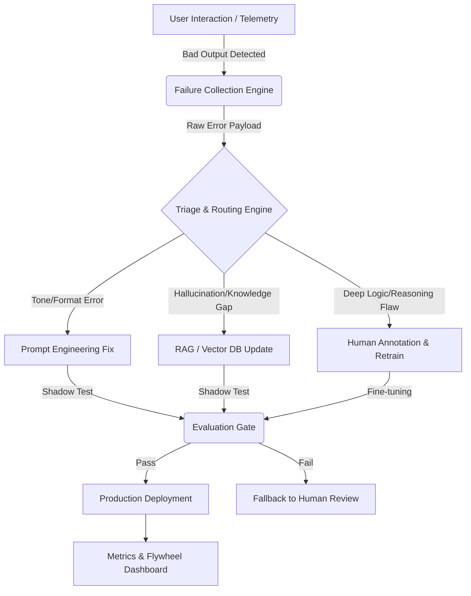

# AI Failure Loop Simulator

An interactive product portfolio project demonstrating how to operationalize the "Data Flywheel" for AI products. This simulator visualizes the end-to-end process of collecting bad AI outputs, intelligently triaging them to the most cost-effective correction method, and tracking the ROI of the continuous improvement loop.

👉 **[Launch Interactive Demo](https://[your-username].github.io/ai-failure-loop-simulator/)**

## 🎯 The Product Problem
Most AI teams treat model deployment as the finish line. In reality, it's the starting line. When models fail in production, teams often default to expensive, slow full-model retraining for every error. This results in massive cloud compute waste and slow time-to-resolution.

## 🎯 Why This Project?

In the current AI landscape, the bottleneck has shifted from **model training** to **inference operations and continuous improvement**. Most AI teams treat model deployment as the finish line. In reality, it is the starting line. 

When AI products fail in production, teams typically default to a "brute force" approach: dumping all bad outputs into a human labeling queue and retraining the base model. This results in:
1. **Massive TCO bloat:** Wasting expensive GPU compute and human labeling hours on simple formatting or knowledge retrieval errors.
2. **High Latency to Resolution:** Waiting weeks for a retraining cycle to fix a bug that could have been solved in minutes.
3. **Catastrophic Forgetting:** Continually retraining the model on edge cases degrades its core reasoning capabilities.

## 💡 The Solution: Intelligent Triage
This simulator demonstrates a productized failure loop that routes errors based on their root cause:
1. **Prompt Engineering (Low Cost):** Fixes tone, formatting, and style.
2. **RAG Updates (Med Cost):** Fixes hallucinations and knowledge gaps by updating the vector database.
3. **Model Retraining (High Cost):** Reserved only for deep logic/reasoning failures.

## 🏗 System Architecture

The system is designed as a closed-loop pipeline. It intercepts failure signals, classifies them, and routes them to the appropriate MLOps workflow.

## 📊 Key Metrics Tracked
- **TCO Savings:** Dollars saved by avoiding unnecessary full-model retraining.
- **Flywheel Velocity:** Percentage of errors resolved via cheap/automated methods vs expensive manual retraining.
- **Time-to-Fix:** SLA tracking for different error categories.

## 🛠 Tech Stack
- Vanilla HTML5, CSS3, JavaScript (ES6)
- No build steps, no frameworks, 100% free to host on GitHub Pages.

## 📁 Project Structure
- `index.html`: Main dashboard layout.
- `js/`: Modular JS handling Collection, Triage, and Metrics.
- `data/`: JSON configurations for mock failures and routing rules.
- `docs/`: Product Requirements Document (PRD) and Architecture diagrams.

## Core Components:
- Collection Engine: Captures explicit (user feedback) and implicit (UI telemetry, rewrite behavior) failure signals.
- Triage & Routing Engine: The "brain" of the loop. Analyzes the failure payload and applies business logic to route it to the most cost-effective correction path.
- Execution Pipelines: The actual MLOps workflows (Prompt versioning, RAG ingestion, Fine-tuning jobs).
- Evaluation Gate: Automated regression testing to ensure the fix doesn't break existing functionality before pushing to production.

